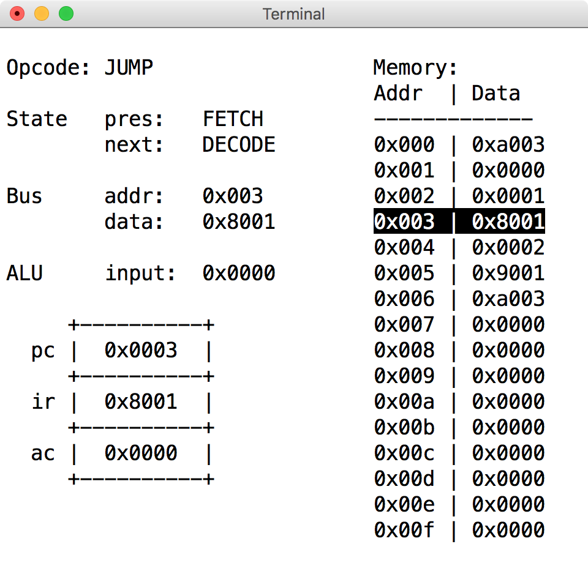

# dobby

University of Southampton second year ELEC2204 Computer Engineering coursework.


## Directory structure

```
.
├── Doxyfile
├── Makefile
├── README.md
├── inc
│   ├── alu.h
│   ├── decoder.h
│   ├── dobby.h
│   ├── examples.h
│   ├── global.h
│   ├── memory.h
│   ├── opcodes.h
│   ├── print.h
│   └── registers.h
└── src
    ├── alu.c
    ├── decoder.c
    ├── dobby.c
    ├── examples.c
    ├── memory.c
    ├── print.c
    └── registers.c
```

## Build instructions

For this project I have made a Makefile to simplify compilation of the files
and their dependencies. This means that if one or two files are changed the
compiler only rebuilds the changed files, thus reducing compile time. To run the
Makefile there are a number of options,
* `make`, builds code to `dobby` executable.
* `make debug`, builds the same as `make` but invokes the DEBUG flag which
writes internal signal values to `dobby.log` on each processor tick.
* `make clean`, cleans directory of build files (`build/`, `dobby` and
`doxygen/`).
* `make docs`, calls Doxygen to generate code documentation.
* `make open`, opens generated Doxygen in web browser.

```
 CC     src/alu.c
 CC     src/decoder.c
 CC     src/dobby.c
 CC     src/examples.c
 CC     src/memory.c
 CC     src/print.c
 CC     src/registers.c
```

## Example assembly

In `examples.h` there are a number of example assembly programs. These programs
are then stored in an array called `*examples`. The examples are then copied
into memory when the user presses certain number keys.

## Output

`dobby.c` uses and ncurses interface to display the current state of the cpu,
values on the data/address bus, inputs and operations passed to the ALU, data
in particular addresses in memory as well as the data stored in the program
counter, instruction register and accumulator.

By pressing `<enter>` (actually, any key besides `<q>`) the system will step
through to the next state of operation. This is to help debug the operation of
the CPU.

The `<u>` and `<d>` keys move the memory table up/down. It is unrealistic to
print all 256 addresses to the screen at the same time.

### Start up instructions

```
Dobby debugging suite.
Other keys increment program counter.
u: Move address list up.
d: Move address list down.
q: Quit program.
1: Program #1
2: Program #2
```

### Operation


